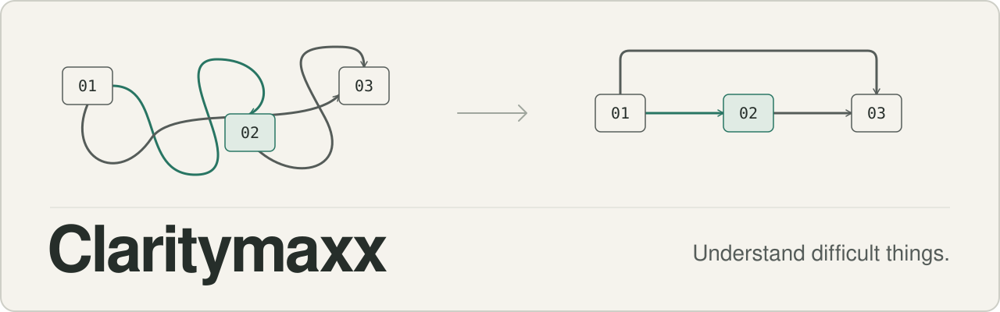

<p align="center">
  
</p>

# Claritymaxx

Understand difficult things.

Claritymaxx is a Claude Code plugin with skills for understanding hard material: code, systems, papers, data, logs, and processes. Models now do more of the implementation work. More of your work is to inspect what they did, judge it, and decide what matters. Claritymaxx helps with that part.

It has one skill today: `explain`.

## Inspiration

Claritymaxx started from [a post by Andrej Karpathy](https://x.com/karpathy/status/2105819303471976479) about understanding the outputs of language models. His observation: as models do more of the implementation work on their own, more human work moves up into oversight and understanding.

He described a progression of output formats for that work:

- **Clear writing.** Ask for prose in the style of ASD-STE100, a controlled language from aerospace maintenance. The full standard is strict, so he suggests a softer target, "80% of the way to ASD-STE100".
- **Diagrams and images**, when structure is easier to see than to read.
- **HTML pages** built for the one question, which can be interactive.
- **Bespoke explainer videos**, the format he is most optimistic about.

The larger idea is that intelligence and code are getting cheap. A custom, disposable artifact made to answer one question was too expensive to build before. Now it is a reasonable thing to ask for.

Both the ladder of output formats and the ASD-STE100 writing style in this project come from that post. Claritymaxx is our implementation and extension of the idea: a reusable skill that builds the mental model first, then chooses the simplest medium that explains the topic well. Karpathy is not involved in this project and has not reviewed or endorsed it.

## What `explain` does

`explain` builds a mental model of the subject before it writes a word of explanation. It reads the source, finds the few parts and relationships that carry most of the difficulty, and separates what the source shows from what it inferred. Then it presents that model in the cheapest medium that works.

```text
> why does this service read from both the cache and the database?
```

`explain` reads the code first. Then it answers the question you asked: which reads go where, why two sources exist, and where they can disagree. It says which parts of that answer it saw in the code and which parts it inferred. If the hard part is the flow of requests, you get a small diagram and a few sentences in place of a page of prose.

It adapts to the reader without a mode switch:

- **Learn.** You have no working model yet. It builds one from first principles, one concept at a time.
- **Inspect.** You know the domain. It skips the basics and goes to relationships, odd decisions, failure modes, and what is known versus inferred.

## Install

In Claude Code:

```text
/plugin marketplace add v60samurai/claritymaxx
/plugin install claritymaxx@claritymaxx
```

Or from a shell:

```bash
claude plugin marketplace add v60samurai/claritymaxx
claude plugin install claritymaxx@claritymaxx
```

Start a new session, or run `/reload-plugins`. To try it without installing, clone the repository and run `claude --plugin-dir ./claritymaxx`.

## Use

Ask in your own words. The skill loads when you want to understand something:

```text
explain how this repo handles retries
what is an embedding?
walk me through the OAuth PKCE flow
I know MVCC. Why does one long transaction bloat tables it never touched?
```

Or call it by name: `/claritymaxx:explain <what you want to understand>`.

## The ladder

```text
text  →  diagram  →  bespoke HTML explainer  →  video (optional)
```

This ladder is Karpathy's progression of output formats (see [Inspiration](#inspiration)). He presents each format as better than the one before for hard material. Claritymaxx adds one rule of its own: it picks the rung where the topic is easiest to understand, and goes no higher. The conditions in the table below are ours.

| Medium | Chosen when |
|--------|-------------|
| Text | One linear path is enough, and you can hold it in your head. |
| Diagram | One or two relationships are the hard part: flow, sequence, dependency, state, cause. |
| HTML explainer | The subject has many interacting parts, and layout, linked views, or detail on demand make it easier to hold: an architecture map, a normal flow next to a failure flow, an incident traced through components. The page does not need controls. |
| Video | The model is a change over time that a still frame hides, or you ask for one. No paid service is required. |

"Why does ice float?" gets a few sentences. An OAuth login flow gets a diagram and a few sentences. A production system with many services, trust boundaries, and an incident to diagnose will often get a small page with a map and the failure path. Not every complex topic gets a page, and a long prompt about one idea still gets text. If you name a medium or a length, you get that.

## Writing style

The prose is inspired by [ASD-STE100 Simplified Technical English](https://www.asd-ste100.org/), a controlled language written for aerospace maintenance documents: familiar words, short sentences, one term for one thing, explicit cause and effect. Using it for explanations is Karpathy's suggestion, and so is the target: "80% of the way to ASD-STE100".

That phrase names a style. It is not a score. Claritymaxx does not check text against the standard and does not claim that its output complies with ASD-STE100. Correct technical terms stay, and when precision and simplicity conflict, precision wins.

Before it sends anything, the skill edits once against a short list of rules: plain words, whole sentences, no em dashes, no filler openers or closers, and no claim that the source does not support. The same pass covers diagram labels, the text in HTML pages, and video narration.

## What is in the repository

```text
.claude-plugin/        plugin and marketplace manifests
skills/explain/        SKILL.md, four reference files, one reference image
evals/                 16 eval cases for `claude plugin eval`, and RUBRIC.md
```

`SKILL.md` is short. The reference files for diagrams, HTML explainers, the ladder, and the writing style load only when a request needs them.

Run the evals from a clone:

```bash
claude plugin eval . --scaffold --allow-tools Write
```

`--scaffold` lets one case create a small fixture repository, and `--allow-tools Write` lets the HTML cases write a file. The cases check invariants such as factual fidelity, medium choice, kept caveats, and stated uncertainty. They do not check wording. `evals/RUBRIC.md` lists the failure categories, including `medium_under_escalation` and `medium_over_escalation`.

## Later

More focused skills for understanding may follow, for example for codebases, systems, research, and data. They will be added when real use shows a need.

## License

[MIT](LICENSE)
